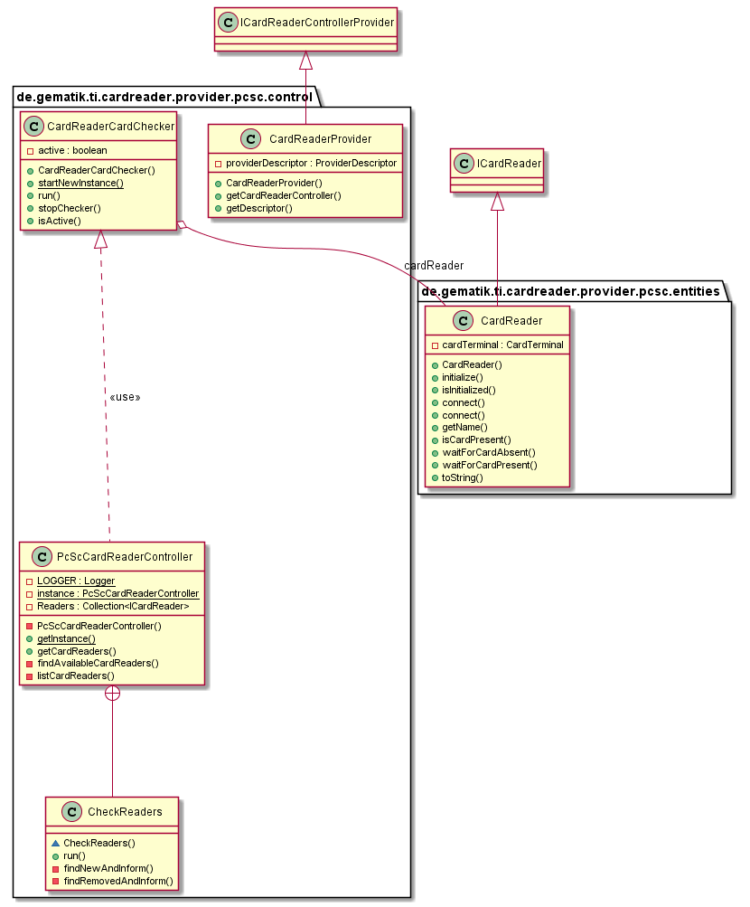
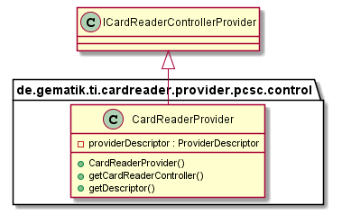
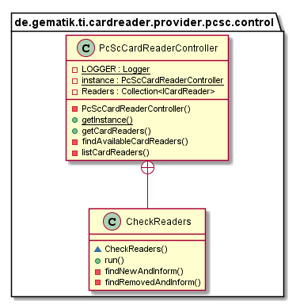
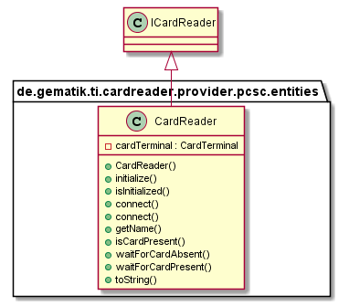

# OCSC CardReaderProvider

## Introduction

This part describes the usage of low level CardReaderProvider for PCSC CardReader in your application.

## API Documentation

Generated API docs are available at <https://gematik.github.io/ref-CardReaderProvider-PCSC>.

## License

Licensed under the [Apache License, Version 2.0](https://www.apache.org/licenses/LICENSE-2.0).

## Overview

  

### Integration

The PCSC CardReaderProvider needs a descriptor behind `YOUR.PROVIDER\src\main\resources\META-INF\services` with filename
`de.gematik.ti.cardreader.provider.spi.ICardReaderControllerProvider` and the content of the package and class which implements the service provider interface
`dde.gematik.ti.cardreader.provider.pcsc.control.CardReaderProvider`.

## Hardware

Each card reader device which communicates over pcsc protocol

## Control

### PCSCCardReaderProvider

The PCSCCardReaderProvider class needs implementation of the interface 'ICardReaderControllerProvider' to handle listener and provide methods to inform connected listeners about card reader changes.

  

### PCSCCardReaderController

The PCSCCardReaderController class extends the abstract class 'AbstractCardReaderController' to handle necessary permissions and checking if the application context is set.
Returns a list with currently connected pcsc cardReaders and informs about reader connection and disconnection.

  

## Entities

### CardReader

The CardReader represent a pcsc card reader with one slot.

  

## Getting Started

### Build setup

To use CardReaderProvider for Tactivo USB CardReader in a project, you need just to include following dependency:

**Gradle dependency settings to use PCSC CardReaderProvider library.**

    dependencies {
        implementation group: 'de.gematik.ti', name: 'cardreader.provider.pcsc', version: '1.1.2'
    }

**Maven dependency settings to use PCSC CardReaderProvider library.**

    <dependencies>
        <dependency>
            <groupId>de.gematik.ti</groupId>
            <artifactId>cardreader.provider.pcsc</artifactId>
            <version>1.1.2</version>
        </dependency>
    </dependencies>
